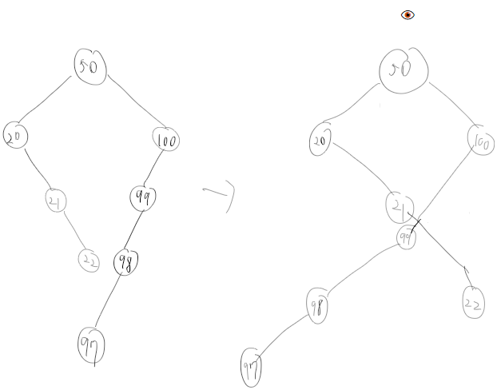

# Practice > Problem Solving
## Implementation
### Forming a Magic Square
[LINK](https://www.hackerrank.com/challenges/magic-square-forming)  
Hint : Magic Square are only few cases.
#### Generate 3x3 Magic Square (python 3)
```py
# generate magic square
# all combinations = 9!
# all combinations with three values = 9!/6!
# all case of magic square = 8 (9!/6! times brute force, need not 9! times)
def checkMagicSq(s):
    nums=[0]*10
    for i in range(len(s)):
        for j in range(len(s)):
            if s[i][j]<1 or s[i][j]>9:
                return False
            else:
                nums[ s[i][j] ]=1
    
    if sum(nums)!=9:
        return False
    
    for i in range(len(s)):
        if sum( s[i][:] )!=15:
            return False
        if s[0][i]+s[1][i]+s[2][i]!=15:
            return False

    if s[0][0]+s[1][1]+s[2][2]!=15:
        return False

    if s[0][2]+s[1][1]+s[2][0]!=15:
        return False
        
        
    return True
    
def genMagicSq():    
    r=[]
    s=[ [0,0,0],[0,0,0],[0,0,0]]
    for i in range(1,9+1):
        for j in range(1,9+1):
            if i!=j:
                for k in range(1,9+1):
                    if i!=k and j!=k:
                        s[0][0]=i
                        s[0][1]=j
                        s[1][1]=k

                        s[0][2]=15-i-j
                        s[2][2]=15-i-k
                        s[1][2]=15-s[0][2]-s[2][2]

                        s[2][1]=15-j-k
                        s[2][0]=15-s[2][1]-s[2][2]

                        s[1][0]=15-i-s[2][0]
                        if checkMagicSq(s):
                            r.append( [[s[y][x] for x in range(3)] for y in range(3) ] )
                            
    
    return r

print(genMagicSq())
```

### Non-Divisible Subset  
[LINK](https://www.hackerrank.com/challenges/non-divisible-subset/problem)  
`(x + y) % k == ( x%k + y%k ) % k` is TRUE.  

## Bit Manipulation
### Counter game
[LINK](https://www.hackerrank.com/challenges/counter-game)  
Can find the number of next largest power of 2?  
If given n=132, put number 2^7=128.  

## Trees
### Tree : Top View
[LINK](https://www.hackerrank.com/challenges/tree-top-view)  
  
answer : 97 20 50 100  

First time, I think drawing the tree like left side. but nothing to do getting answer.  
Draw a tree in the test-case and find how to do that.  
I found abstracting the tree at right side on the drawing.  
