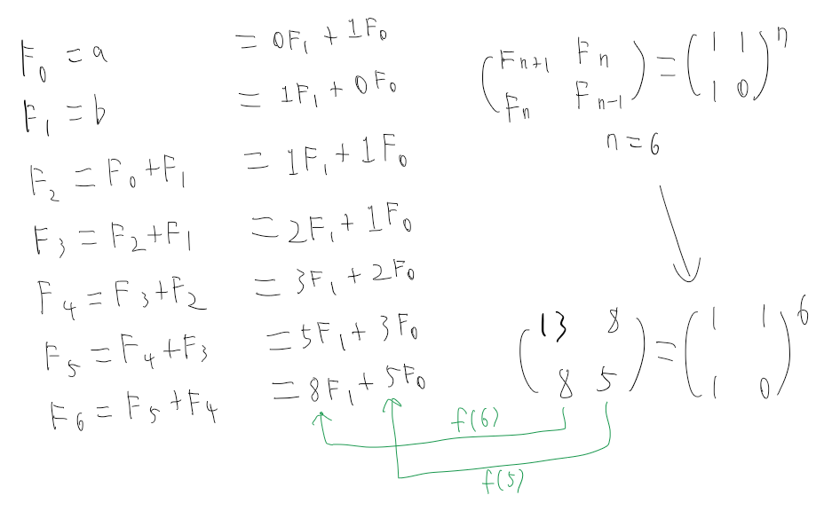

# Practice > Problem Solving
## Number Theory
### Fibonacci Finding (easy)
#### [problem link](https://www.hackerrank.com/challenges/fibonacci-finding-easy)  
#### F(6) = B×f(6) + A×f(5)
  
#### Discussion
Get original fibonacci number by martix. Matrix power calculating by Divide-and-conquer.  
Multiply A and B by calculated original fibonacci numbers.  
